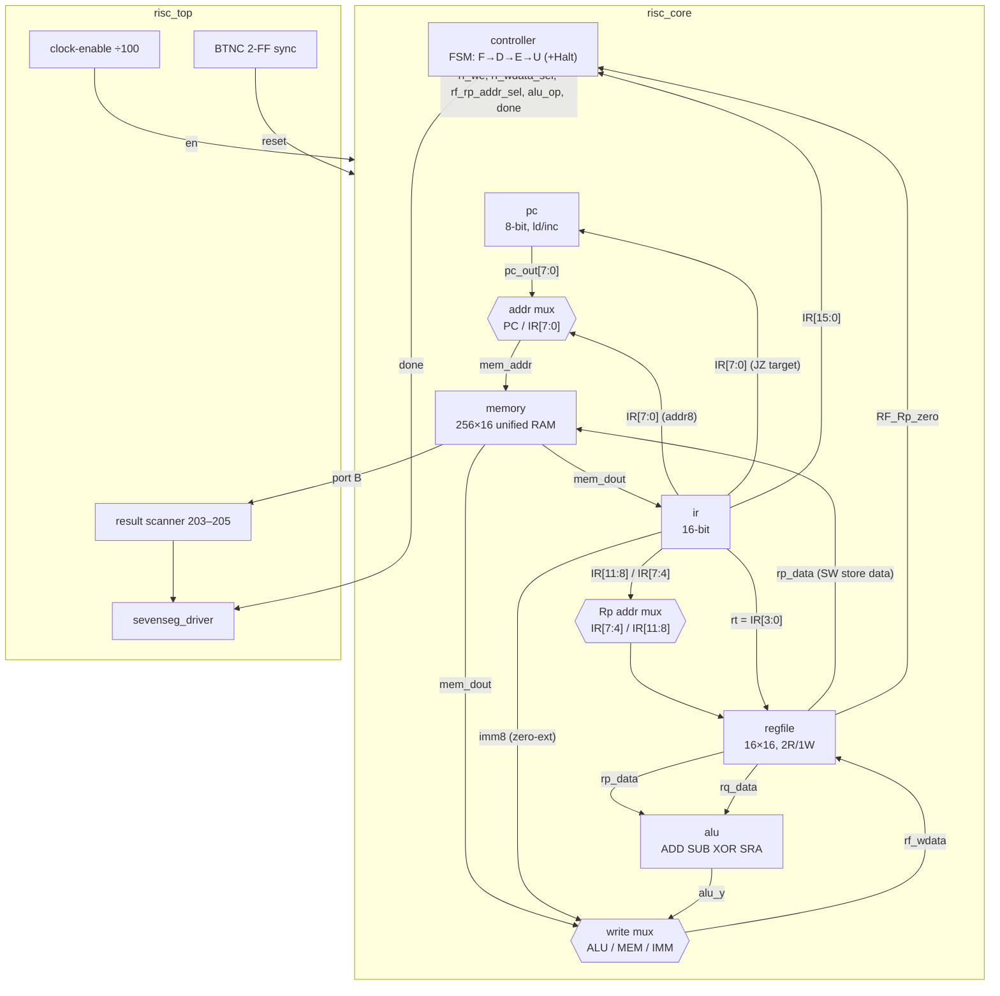
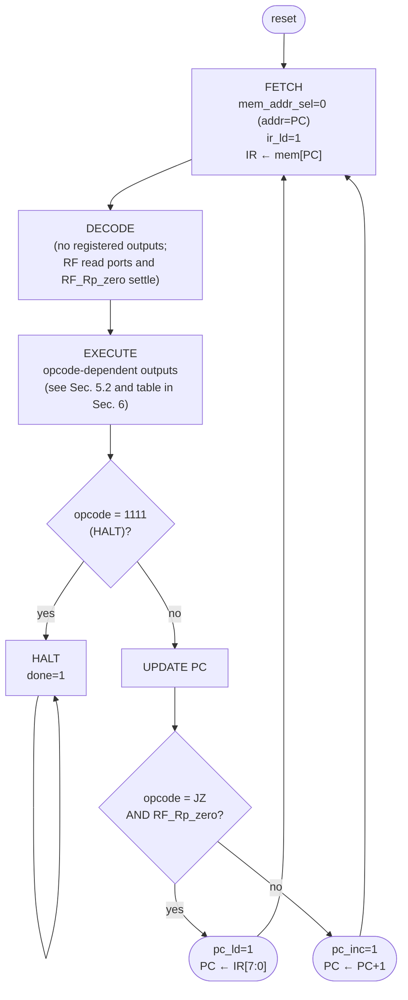
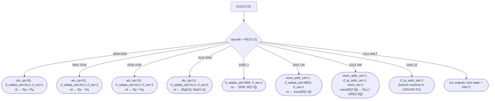

<div align="center">

# EE 5193 — FPGA and HDL

## Summer 2026

**Electrical and Computer Engineering Department**
**University of Texas at San Antonio**

---

# A Multi-Cycle 16-Bit RISC Processor on the Nexys A7

**Course Project Report**

**Sergio Arreola**

July 10, 2026

</div>

---

## 2. Problem Statement

The goal of this project is to design, simulate, and implement a small
Reduced Instruction Set Computer (RISC) on the Digilent Nexys A7 board
(Artix-7 XC7A100T-1CSG324C) using Vivado. The processor executes 16-bit
instructions whose leftmost four bits are the opcode, and every functional
block in the datapath/controller diagram has to be written as its own
Verilog module.

The controller is specified to have exactly two inputs — the 16-bit IR value
and a flag `RF_Rp_zero` from the register file indicating that the value on
read port P is zero — and it must sequence every instruction through the same
four steps:

1. **Fetch** — read the instruction at memory location PC into the IR,
2. **Decode** — interpret the opcode and register/address fields,
3. **Execute** — perform the operation,
4. **Update PC** — point the PC at the next memory location.

Memory locations 201 and 202 hold initial operand values. The demonstration
program below loads them, computes with them, and stores three results at
locations 203, 204, and 205, which must appear on the board's 7-segment
display once the program has finished:

| # | Mnemonic | Encoding |
|---|----------|----------|
| 0 | `LW  r5, 201`   | `1001_0101_1100_1001` |
| 1 | `LW  r6, 202`   | `1001_0110_1100_1010` |
| 2 | `ADD r7, r5, r6`| `0000_0111_0101_0110` |
| 3 | `SW  r7, 203`   | `1010_0111_1100_1011` |
| 4 | `LI  r8, 250`   | `1000_1000_1111_1010` |
| 5 | `SUB r4, r8, r5`| `0001_0100_1000_0101` |
| 6 | `SW  r4, 204`   | `1010_0100_1100_1100` |
| 7 | `SRA r3, r7`    | `0110_0011_0111_0000` * |
| 8 | `XOR r2, r3, r4`| `0100_0010_0011_0100` |
| 9 | `SW  r2, 205`   | `1010_0010_1100_1101` |

\* The handout gives `0110_0010_0111_0000` for this instruction, whose
destination field decodes to r2, not r3. That contradicts both the mnemonic
and the following XOR, which reads r3. I use the corrected encoding here;
Section 9.1 describes how I found the discrepancy in simulation.

The deliverables are the Verilog modules, a block diagram, ASM-D charts, a
controller output table per opcode, simulation results, and this report.

## 3. Approach

### 3.1 Multi-cycle organization

I implemented the processor as a multi-cycle machine: one controller FSM
state per architectural step, so every instruction takes exactly four states
(Fetch, Decode, Execute, UpdatePC). This maps one-to-one onto the four-step
process the assignment requires, which makes the controller easy to specify,
easy to draw as an ASM-D chart, and easy to check in a waveform — the state
register tells you exactly which step you are looking at. A single-cycle
design would have needed separate instruction and data memories (the
assignment wants one memory holding both program and data), and a pipelined
design is unjustifiable for a ten-instruction demo.

The FSM has a fifth, terminal state, **Halt**. The demo program is ten
instructions long and the assignment says results are displayed "once all
instructions have executed," so the machine needs a defined way to stop.
I assigned opcode `1111` to a HALT instruction, placed one at address 10
(right after the program), and made the controller park in the Halt state
with a `done` output high. `done` gates the display and drives LED0, and the
testbench uses it to know when to check results.

### 3.2 One unified memory

Program and data share a single 256 × 16-bit memory. Address 0–10 hold the
program (plus HALT), 201/202 hold the input operands, and 203–205 receive
the results. A unified memory means one address bus and a single two-way
address mux: during Fetch the address is the PC, and during the Execute step
of LW/SW it is the 8-bit address field IR[7:0]. Since the machine is
multi-cycle, instruction fetch and data access never happen in the same
state, so one port is enough and there is no structural hazard.

The CPU port of the memory uses a **combinational read** with a synchronous
write. This is a deliberate choice: with an asynchronous read, the fetched
word is available at the memory output in the same state the address is
applied, so Fetch and the LW Execute step each fit in a single FSM state and
the four-step model stays exact. Vivado infers distributed (LUT) RAM for
this style, which costs a few hundred LUTs at 256 × 16 — cheap on an
XC7A100T. My first version used a registered read that maps to block RAM,
and the one-cycle read latency quietly broke the four-step model; Section
9.2 covers that bug and why I settled on distributed RAM.

Initial contents (the ten instructions, the HALT, and the operands 25 and 35
at 201/202) are loaded from `program.mem` with `$readmemb`, so the same
image feeds both simulation and synthesis.

### 3.3 Controller

The controller matches the assignment's interface exactly: its only inputs
(besides clock, reset, and the clock enable) are `IR[15:0]` and
`RF_Rp_zero`. It is a five-state FSM (the four steps plus Halt). All outputs
are generated in a single combinational block with default assignments
first, so no latches are inferred; the opcode `IR[15:12]` selects the
Execute-step outputs, and `RF_Rp_zero` is consulted in exactly one place.

About that flag: none of the ten demo instructions is conditional, but the
assignment specifies `RF_Rp_zero` as a controller input, so I gave it a real
job rather than leaving a dangling port. I defined a conditional branch,
`JZ rs, addr` (opcode `1100`, same field layout as SW): if the register on
read port P is zero, the PC loads `IR[7:0]` in the UpdatePC step instead of
incrementing. The demo program never executes a JZ, but the path is
implemented, simulated, and documented in the controller table, and it is
the reason the PC has a load input as well as an increment.

### 3.4 Reuse of previously developed modules

Two blocks in this design are adaptations of modules I built earlier in the
course rather than new work:

- **ALU/shifter** (`alu.v`): the arithmetic unit from the earlier
  combinational-design lab, trimmed to the four operations this ISA needs
  (ADD, SUB, XOR, and a one-bit arithmetic right shift). The shift is the
  sign-replicating `{a[15], a[15:1]}` slice from the lab shifter; I removed
  the ops this project doesn't use rather than carrying dead logic through
  synthesis.
- **7-segment scan driver** (`sevenseg_driver.v`): the multiplexed 8-digit
  driver from the display lab. For this project I added a per-digit blanking
  mask (to insert dark separator digits between the three result bytes) and
  a "dash mode" that shows `-- -- --` while the CPU is still running, so the
  display state distinguishes "running" from "done" at a glance.

Everything else — PC, IR, register file, memory, controller, and the top
level — was written new for this project, one module per box in the block
diagram.

### 3.5 Register file and instruction formats

The register file is 16 × 16-bit with two combinational read ports (P and Q)
and one synchronous write port. Port P also produces the `RF_Rp_zero` flag
(`rp_data == 0`) required by the controller. The instruction formats decode
as:

| Format | Opcode(s) | [15:12] | [11:8] | [7:4] | [3:0] |
|---|---|---|---|---|---|
| R-type | ADD `0000`, SUB `0001`, XOR `0100` | opcode | rd | rs | rt |
| Shift  | SRA `0110` | opcode | rd | rs | unused |
| LI     | `1000` | opcode | rd | imm8 (zero-extended) | |
| LW     | `1001` | opcode | rd | addr8 | |
| SW     | `1010` | opcode | rs | addr8 | |
| JZ     | `1100` | opcode | rs | addr8 | |
| HALT   | `1111` | opcode | unused | | |

One decode wrinkle: for SW and JZ the *source* register sits in bits [11:8],
where every other format keeps the destination. Rather than add a third read
port, read port P's address comes through a small mux
(`rf_rp_addr_sel`): normally `IR[7:4]` (rs), but `IR[11:8]` during the
Execute step of SW/JZ. The store data path is then simply port P into the
memory's write-data input.

LI zero-extends its 8-bit immediate; with values up to 250 in the demo
program, sign extension would corrupt anything above 127. SRA shifts by one
bit with sign replication, which matches the expected result
(SRA of 60 → 30).

### 3.6 Initial data and hand-calculated results

I chose `mem[201] = 25` and `mem[202] = 35`. Every intermediate value is
distinct and each instruction visibly changes state, so a single waveform
pass verifies all of them:

| # | Instruction | Effect | Value |
|---|---|---|---|
| 0 | `LW r5, 201` | r5 ← mem[201] | 25 |
| 1 | `LW r6, 202` | r6 ← mem[202] | 35 |
| 2 | `ADD r7, r5, r6` | r7 ← 25 + 35 | 60 |
| 3 | `SW r7, 203` | mem[203] ← r7 | **60 (0x3C)** |
| 4 | `LI r8, 250` | r8 ← 250 | 250 |
| 5 | `SUB r4, r8, r5` | r4 ← 250 − 25 | 225 |
| 6 | `SW r4, 204` | mem[204] ← r4 | **225 (0xE1)** |
| 7 | `SRA r3, r7` | r3 ← 60 >>> 1 | 30 |
| 8 | `XOR r2, r3, r4` | r2 ← 0x001E ^ 0x00E1 | 255 |
| 9 | `SW r2, 205` | mem[205] ← r2 | **255 (0xFF)** |

The XOR is worth spelling out: 30 = `0001_1110`, 225 = `1110_0001`; the
operands are bitwise complements over the low byte, so the result is
`1111_1111` = 255. The display therefore ends at `3C E1 FF`.

### 3.7 Clocking, reset, and the display path

The whole design runs in a single 100 MHz clock domain. The CPU is throttled
by a **clock enable** — a one-cycle pulse every 100 clocks (1 MHz
architectural rate) — rather than a divided clock. Every sequential element
in the core (PC, IR, register file write, memory write, FSM state) qualifies
its update with `en`, while the display logic runs at the full 100 MHz.
My first attempt used a divided clock and turned into a two-clock-domain
design with CDC warnings; Section 9.5 explains the switch. At 1 MHz the
program finishes in about 44 µs — instant to the eye, but the rate is
trivially adjustable if I ever want to single-step with a slower enable.

Reset is the center pushbutton (BTNC), taken through a two-flop
synchronizer. Because it is a level reset and the FSM only advances once
every 100 clocks, contact bounce just stretches the reset interval; no
separate debouncer is needed.

For output, the memory has a second, read-only combinational port that the
CPU never uses. A small scanner in the top level continuously cycles it
through addresses 203/204/205 and latches the three words into result
registers. The display shows the low byte of each in hex across the eight
digits as `3C  E1  FF` (digit pairs 7–6, 4–3, 1–0, with digits 5 and 2
blanked as separators). Until `done` goes high the enabled digits show
dashes, so the board visibly distinguishes reset/running from finished. I
chose hex over decimal because three 3-digit decimal numbers need nine
digits — one more than the board has — while hex is unambiguous, and the
report and testbench give the decimal equivalents.

## 4. Block Diagram

Every box below is one Verilog module (one file each); `risc_core.v`
instantiates the six core blocks plus the three datapath muxes, and
`risc_top.v` adds the board-level blocks.

```
                              ~~~~~~~~~~~ risc_core ~~~~~~~~~~~
                                                                 IR[15:0]
        +------------------------------------------------------------+
        |                        CONTROLLER                          |<-- RF_Rp_zero
        |        FSM: Fetch -> Decode -> Execute -> UpdatePC         |--> done
        +------------------------------------------------------------+
          | pc_ld   | ir_ld   | mem_addr_sel | rf_we        | alu_op
          | pc_inc  |         | mem_we       | rf_wdata_sel |
          v         v         v              | rf_rp_addr_sel
                                             v
        +------+  pc_out[7:0]   +---+
        |  PC  |--------------->| M |  mem_addr[7:0]  +----------------+
        +------+           .--->| U |---------------->|     MEMORY     |
           ^               |    | X |                 |  256 x 16 RAM  |
           | IR[7:0]       |    +---+                 |  (port A: CPU) |
           | (JZ target)   |   sel = mem_addr_sel     |                |
           |               |                          |  din     dout  |
           |   IR[7:0] ----+                          +----------------+
           |   (addr8)                                    ^        |
           |                                     Rp_data  |        | mem_dout[15:0]
           |                                    (SW data) |        |
           |                                              |        v
           |    +----------------+   ir_out[15:0]    +---------+   |
           +----|       IR       |<------------------|  (from  |   |
                +----------------+     (ir_in)       |  dout)  |   |
                  | | | |                            +---------+   |
     rd=IR[11:8]  | | | |  rs=IR[7:4], rt=IR[3:0], imm8/addr8      |
                  v v v v                                          |
        +---+   +------------------------+                        |
 IR[11:8]| M |   |     REGISTER FILE      |                        |
 ------->| U |-->| 16 x 16, 2R / 1W       |                        |
 IR[7:4] | X |   |  rp_addr    rq_addr    |                        |
 ------->|   |   |  waddr <- IR[11:8]     |--> RF_Rp_zero          |
        +---+   |  wdata <- write mux    |    (to controller)     |
   sel = rf_rp_ |  rp_data     rq_data   |                        |
       addr_sel +------------------------+                        |
                      |            |                              |
                      v            v                              |
                   +------------------+                           |
                   |       ALU        |                           |
                   | ADD SUB XOR SRA  |                           |
                   +------------------+                           |
                          | alu_y                                 |
                          v                                       |
                   +-------------+  <---- mem_dout ---------------+
                   |  WRITE MUX  |  <---- {8'd0, IR[7:0]} (LI imm)
                   +-------------+
                          |  rf_wdata (back up to register file)
                          v
        sel = rf_wdata_sel: 00 ALU / 01 MEM / 10 IMM

        ~~~~~~~~~~~ risc_top (board level) ~~~~~~~~~~~

  clk 100MHz --> [CLOCK-ENABLE DIVIDER /100] --> en (to every core block)
  BTNC ------> [2-FF SYNC] --> reset
  MEMORY port B <--> [RESULT SCANNER: addr 203/204/205, 3 latches]
                              |
                              v
                     [SEVENSEG_DRIVER  8-digit scan]---> AN[7:0], CA..CG, DP
  done ---------------------------------------------> LED0, dash-mode select
```

The same structure in Mermaid form (this is the figure I reproduce in the
drawn diagram):



## 5. ASM-D Charts

### 5.1 Overall four-step loop

Drawing conventions: rectangles are states (Moore outputs listed inside),
diamonds are decisions, and rounded boxes are conditional (Mealy) outputs
valid within the state they hang off. Every register transfer written next
to a state happens on the clock-enable edge that *leaves* that state.



In words: out of reset the FSM sits in FETCH with the address mux pointed at
the PC and `ir_ld` asserted, so the instruction word is captured into the IR
on the state-exit edge. DECODE asserts nothing; it exists so the register
file's combinational read ports (and the `RF_Rp_zero` flag) settle a full
state before EXECUTE uses them, and it is where the opcode fields become
valid to the controller. EXECUTE raises the per-opcode signals from the
Section 6 table. The HALT test hangs off EXECUTE: opcode `1111` sends the
machine to the terminal HALT state, which holds `done` high forever (only
reset leaves it). UPDATE PC is the one place `RF_Rp_zero` matters — a JZ
whose source register read zero loads the branch target `IR[7:0]` into the
PC; every other case increments.

### 5.2 Execute-step branching per opcode



## 6. Controller Output Table

Signals: `PC_ld`, `PC_inc` (program counter), `IR_ld` (instruction
register), `MemSel` = `mem_addr_sel` (0 = PC, 1 = IR[7:0]), `Mem_we`,
`RF_we`, `WSel` = `rf_wdata_sel` (00 = ALU, 01 = memory, 10 = immediate),
`RpSel` = `rf_rp_addr_sel` (0 = IR[7:4], 1 = IR[11:8]), `ALU` = `alu_op`
(00 ADD, 01 SUB, 10 XOR, 11 SRA), `done`. Unlisted values are 0; "–" means
don't-care (the default 0/00 is emitted so the logic stays latch-free).

**Steps common to every opcode:**

| Step | PC_ld | PC_inc | IR_ld | MemSel | Mem_we | RF_we | WSel | RpSel | ALU | done |
|---|---|---|---|---|---|---|---|---|---|---|
| Fetch | 0 | 0 | **1** | **0 (PC)** | 0 | 0 | – | – | – | 0 |
| Decode | 0 | 0 | 0 | – | 0 | 0 | – | – | – | 0 |
| UpdatePC (all except taken JZ) | 0 | **1** | 0 | – | 0 | 0 | – | – | – | 0 |
| UpdatePC (JZ with RF_Rp_zero = 1) | **1** | 0 | 0 | – | 0 | 0 | – | **1** | – | 0 |
| Halt (terminal state) | 0 | 0 | 0 | – | 0 | 0 | – | – | – | **1** |

**Execute step, by opcode:**

| Opcode | Instr | PC_ld | PC_inc | IR_ld | MemSel | Mem_we | RF_we | WSel | RpSel | ALU | done |
|---|---|---|---|---|---|---|---|---|---|---|---|
| `0000` | ADD | 0 | 0 | 0 | – | 0 | **1** | **00** | 0 | **00** | 0 |
| `0001` | SUB | 0 | 0 | 0 | – | 0 | **1** | **00** | 0 | **01** | 0 |
| `0100` | XOR | 0 | 0 | 0 | – | 0 | **1** | **00** | 0 | **10** | 0 |
| `0110` | SRA | 0 | 0 | 0 | – | 0 | **1** | **00** | 0 | **11** | 0 |
| `1000` | LI  | 0 | 0 | 0 | – | 0 | **1** | **10** | – | – | 0 |
| `1001` | LW  | 0 | 0 | 0 | **1 (IR)** | 0 | **1** | **01** | – | – | 0 |
| `1010` | SW  | 0 | 0 | 0 | **1 (IR)** | **1** | 0 | – | **1** | – | 0 |
| `1100` | JZ  | 0 | 0 | 0 | – | 0 | 0 | – | **1** | – | 0 |
| `1111` | HALT | 0 | 0 | 0 | – | 0 | 0 | – | – | – | 0 |

Notes: SW and JZ set `RpSel = 1` because their source register is in
IR[11:8]. JZ asserts nothing else in Execute — it only steers read port P so
that `RF_Rp_zero` reflects the tested register; the actual PC action happens
in UpdatePC. HALT's Execute step is a no-op whose only effect is the
transition into the terminal Halt state.

## 7. Verilog Code

All modules are Verilog-2001, one file per block, written to synthesize
cleanly in Vivado (no latches, single clock domain, memory styles chosen to
infer distributed RAM). The testbench is simulation-only.


### 7.1 `controller.v` — the FSM controller

```verilog
`timescale 1ns / 1ps
//-----------------------------------------------------------------------------
// controller.v -- four-state FSM controller (Fetch / Decode / Execute / UpdatePC)
// EE 5193 FPGA and HDL, Summer 2026 -- RISC project
// Sergio Arreola
//
// Inputs, exactly as the assignment specifies: the 16-bit IR value and the
// RF_Rp_zero flag from the register file. The FSM walks the four required
// steps for every instruction and branches on the opcode (IR[15:12]) only
// inside the Execute and UpdatePC steps. RF_Rp_zero is consulted only by
// the conditional branch JZ; a HALT opcode parks the machine in a fifth,
// terminal state and raises `done` for the testbench and the display.
//
// State register updates are qualified by `en` (the CPU clock enable), so
// each architectural step lasts one enable period. Outputs are a pure
// function of (state, opcode, rp_zero) -- Moore-style states with a Mealy
// branch decision in UpdatePC -- generated in one combinational block with
// default assignments first, so no latches are inferred.
//-----------------------------------------------------------------------------
module controller (
    input  wire        clk,
    input  wire        reset,          // synchronous, active high
    input  wire        en,             // CPU clock enable
    input  wire [15:0] ir,             // instruction register value
    input  wire        rf_rp_zero,     // register file read-port-P == 0 flag

    // PC controls
    output reg         pc_ld,          // load branch target (taken JZ)
    output reg         pc_inc,         // PC <- PC + 1
    // IR control
    output reg         ir_ld,          // capture memory output into IR
    // Memory controls
    output reg         mem_addr_sel,   // 0: addr = PC (fetch), 1: addr = IR[7:0]
    output reg         mem_we,         // memory write (SW)
    // Register file controls
    output reg         rf_we,          // register write (ADD/SUB/XOR/SRA/LI/LW)
    output reg  [1:0]  rf_wdata_sel,   // 00: ALU, 01: memory, 10: zero-ext imm8
    output reg         rf_rp_addr_sel, // 0: Rp addr = IR[7:4], 1: IR[11:8] (SW/JZ)
    // ALU control
    output reg  [1:0]  alu_op,         // 00 ADD, 01 SUB, 10 XOR, 11 SRA
    // Status
    output reg         done            // program finished (HALT reached)
);

    // Opcodes (IR[15:12])
    localparam [3:0] OP_ADD  = 4'b0000,
                     OP_SUB  = 4'b0001,
                     OP_XOR  = 4'b0100,
                     OP_SRA  = 4'b0110,
                     OP_LI   = 4'b1000,
                     OP_LW   = 4'b1001,
                     OP_SW   = 4'b1010,
                     OP_JZ   = 4'b1100,   // branch if Rp == 0 (uses RF_Rp_zero)
                     OP_HALT = 4'b1111;

    // Write-data mux encodings
    localparam [1:0] WD_ALU = 2'b00,
                     WD_MEM = 2'b01,
                     WD_IMM = 2'b10;

    // States: the four required steps plus a terminal halt state
    localparam [2:0] S_FETCH  = 3'd0,
                     S_DECODE = 3'd1,
                     S_EXEC   = 3'd2,
                     S_UPDATE = 3'd3,
                     S_HALT   = 3'd4;

    reg [2:0] state, next_state;

    wire [3:0] opcode = ir[15:12];

    // ---- state register -----------------------------------------------
    always @(posedge clk) begin
        if (reset)
            state <= S_FETCH;
        else if (en)
            state <= next_state;
    end

    // ---- next-state logic ----------------------------------------------
    always @* begin
        case (state)
            S_FETCH:  next_state = S_DECODE;
            S_DECODE: next_state = S_EXEC;
            S_EXEC:   next_state = (opcode == OP_HALT) ? S_HALT : S_UPDATE;
            S_UPDATE: next_state = S_FETCH;
            S_HALT:   next_state = S_HALT;
            default:  next_state = S_FETCH;
        endcase
    end

    // ---- output logic ----------------------------------------------------
    // Defaults first so every path is covered and nothing infers a latch.
    always @* begin
        pc_ld          = 1'b0;
        pc_inc         = 1'b0;
        ir_ld          = 1'b0;
        mem_addr_sel   = 1'b0;      // default: address = PC
        mem_we         = 1'b0;
        rf_we          = 1'b0;
        rf_wdata_sel   = WD_ALU;
        rf_rp_addr_sel = 1'b0;      // default: Rp reads rs = IR[7:4]
        alu_op         = 2'b00;
        done           = 1'b0;

        case (state)
            // Step 1: instruction at mem[PC] into IR
            S_FETCH: begin
                mem_addr_sel = 1'b0;
                ir_ld        = 1'b1;
            end

            // Step 2: opcode/fields settle; register file read ports and
            // the RF_Rp_zero flag become valid. No register is written.
            S_DECODE: begin
                // no asserted outputs -- decode is combinational off the IR
            end

            // Step 3: per-opcode work
            S_EXEC: begin
                case (opcode)
                    OP_ADD: begin
                        alu_op       = 2'b00;
                        rf_wdata_sel = WD_ALU;
                        rf_we        = 1'b1;
                    end
                    OP_SUB: begin
                        alu_op       = 2'b01;
                        rf_wdata_sel = WD_ALU;
                        rf_we        = 1'b1;
                    end
                    OP_XOR: begin
                        alu_op       = 2'b10;
                        rf_wdata_sel = WD_ALU;
                        rf_we        = 1'b1;
                    end
                    OP_SRA: begin
                        alu_op       = 2'b11;
                        rf_wdata_sel = WD_ALU;
                        rf_we        = 1'b1;
                    end
                    OP_LI: begin
                        rf_wdata_sel = WD_IMM;
                        rf_we        = 1'b1;
                    end
                    OP_LW: begin
                        mem_addr_sel = 1'b1;     // address = IR[7:0]
                        rf_wdata_sel = WD_MEM;
                        rf_we        = 1'b1;
                    end
                    OP_SW: begin
                        mem_addr_sel   = 1'b1;   // address = IR[7:0]
                        rf_rp_addr_sel = 1'b1;   // Rp reads rs = IR[11:8]
                        mem_we         = 1'b1;
                    end
                    OP_JZ: begin
                        rf_rp_addr_sel = 1'b1;   // Rp reads rs = IR[11:8];
                                                 // branch resolves in UpdatePC
                    end
                    default: ;                   // OP_HALT and unused opcodes
                endcase
            end

            // Step 4: next sequential address, or the branch target for a
            // taken JZ (this is the one place RF_Rp_zero is used)
            S_UPDATE: begin
                if (opcode == OP_JZ && rf_rp_zero) begin
                    rf_rp_addr_sel = 1'b1;       // keep rs selected so the
                    pc_ld          = 1'b1;       // flag stays valid
                end else begin
                    pc_inc = 1'b1;
                end
            end

            S_HALT: begin
                done = 1'b1;
            end

            default: ;
        endcase
    end

endmodule
```

### 7.2 `pc.v` — program counter

```verilog
`timescale 1ns / 1ps
//-----------------------------------------------------------------------------
// pc.v -- 8-bit program counter
// EE 5193 FPGA and HDL, Summer 2026 -- RISC project
// Sergio Arreola
//
// Holds the address of the current instruction. Supports synchronous load
// (for taken branches) and increment (UpdatePC step). Load has priority over
// increment; the controller never asserts both. All updates are qualified by
// the CPU clock enable `en` so the whole core can be throttled from the
// 100 MHz board clock without a derived clock.
//-----------------------------------------------------------------------------
module pc (
    input  wire       clk,
    input  wire       reset,   // synchronous, active high
    input  wire       en,      // CPU clock enable
    input  wire       ld,      // load pc_in (branch target)
    input  wire       inc,     // pc <= pc + 1
    input  wire [7:0] pc_in,   // branch target from IR[7:0]
    output reg  [7:0] pc_out
);

    always @(posedge clk) begin
        if (reset)
            pc_out <= 8'd0;
        else if (en) begin
            if (ld)
                pc_out <= pc_in;
            else if (inc)
                pc_out <= pc_out + 8'd1;
        end
    end

endmodule
```

### 7.3 `ir.v` — instruction register

```verilog
`timescale 1ns / 1ps
//-----------------------------------------------------------------------------
// ir.v -- 16-bit instruction register
// EE 5193 FPGA and HDL, Summer 2026 -- RISC project
// Sergio Arreola
//
// Captures the memory output word at the end of the Fetch step. The
// controller decodes ir_out directly; the fields are
//   ir_out[15:12] opcode
//   ir_out[11:8]  rd (or rs for SW/JZ)
//   ir_out[7:4]   rs
//   ir_out[3:0]   rt
//   ir_out[7:0]   imm8 / addr8
//-----------------------------------------------------------------------------
module ir (
    input  wire        clk,
    input  wire        reset,   // synchronous, active high
    input  wire        en,      // CPU clock enable
    input  wire        ld,      // capture ir_in
    input  wire [15:0] ir_in,   // memory read data
    output reg  [15:0] ir_out
);

    always @(posedge clk) begin
        if (reset)
            ir_out <= 16'd0;
        else if (en && ld)
            ir_out <= ir_in;
    end

endmodule
```

### 7.4 `regfile.v` — register file with RF_Rp_zero flag

```verilog
`timescale 1ns / 1ps
//-----------------------------------------------------------------------------
// regfile.v -- 16 x 16-bit register file, 2 read ports / 1 write port
// EE 5193 FPGA and HDL, Summer 2026 -- RISC project
// Sergio Arreola
//
// Read ports are combinational (the Decode step gives the read data a full
// state period to settle before the Execute step uses it). The write port is
// synchronous and qualified by the CPU clock enable. Writes use a
// non-blocking assignment so a read and a write in the same cycle return the
// OLD register value -- see the report, "Problems encountered", for the
// blocking-assignment bug this replaced.
//
// rp_zero is the flag required by the assignment: it is high whenever the
// value currently presented on read port P is zero. The controller samples
// it during Execute to resolve the conditional branch (JZ).
//-----------------------------------------------------------------------------
module regfile (
    input  wire        clk,
    input  wire        en,        // CPU clock enable
    input  wire        we,        // write enable (Execute step of writing ops)
    input  wire [3:0]  waddr,     // destination register rd
    input  wire [15:0] wdata,     // from write-data mux (ALU / mem / imm)
    input  wire [3:0]  rp_addr,   // read port P address
    input  wire [3:0]  rq_addr,   // read port Q address
    output wire [15:0] rp_data,
    output wire [15:0] rq_data,
    output wire        rp_zero    // flag to controller: rp_data == 0
);

    reg [15:0] rf [0:15];

    integer i;
    initial begin
        for (i = 0; i < 16; i = i + 1)
            rf[i] = 16'd0;
    end

    always @(posedge clk) begin
        if (en && we)
            rf[waddr] <= wdata;
    end

    assign rp_data = rf[rp_addr];
    assign rq_data = rf[rq_addr];
    assign rp_zero = (rp_data == 16'd0);

endmodule
```

### 7.5 `alu.v` — ALU (reused from earlier lab)

```verilog
`timescale 1ns / 1ps
//-----------------------------------------------------------------------------
// alu.v -- 16-bit ALU: ADD, SUB, XOR, SRA
// EE 5193 FPGA and HDL, Summer 2026 -- RISC project
// Sergio Arreola
//
// Adapted from the ALU/shifter developed in the earlier combinational-logic
// lab; trimmed to the four operations this instruction set needs. Purely
// combinational. SRA shifts operand A right by one with sign replication
// (operand B is ignored for that op).
//-----------------------------------------------------------------------------
module alu (
    input  wire [15:0] a,       // register file read port P
    input  wire [15:0] b,       // register file read port Q
    input  wire [1:0]  op,      // 00 ADD, 01 SUB, 10 XOR, 11 SRA
    output reg  [15:0] y
);

    localparam [1:0] ALU_ADD = 2'b00,
                     ALU_SUB = 2'b01,
                     ALU_XOR = 2'b10,
                     ALU_SRA = 2'b11;

    always @* begin
        case (op)
            ALU_ADD: y = a + b;
            ALU_SUB: y = a - b;
            ALU_XOR: y = a ^ b;
            ALU_SRA: y = {a[15], a[15:1]};   // arithmetic shift right by 1
            default: y = 16'd0;
        endcase
    end

endmodule
```

### 7.6 `memory.v` — unified 256x16 memory

```verilog
`timescale 1ns / 1ps
//-----------------------------------------------------------------------------
// memory.v -- unified 256 x 16-bit instruction/data memory
// EE 5193 FPGA and HDL, Summer 2026 -- RISC project
// Sergio Arreola
//
// One memory holds both the program (addresses 0..10) and the data
// (201/202 in, 203..205 out), so a single address mux switches the CPU
// between fetching (addr = PC) and load/store (addr = IR[7:0]).
//
// Port A is the CPU port: combinational read, synchronous write. The
// combinational read is deliberate -- it lets Fetch and LW each complete in
// one FSM state. Vivado infers distributed (LUT) RAM for this, which is
// cheap at 256x16. I originally wrote a registered-read version that maps
// to block RAM, but the one-cycle read latency broke the four-state execute
// model (see "Problems encountered" in the report).
//
// Port B is a read-only combinational port used only by the display logic
// in the top level to scan mem[203..205]; the CPU never touches it.
//
// Initial contents come from program.mem via $readmemb: the ten demo
// instructions plus a HALT at 0..10, and the operands 25/35 at 201/202.
//-----------------------------------------------------------------------------
module memory #(
    parameter MEM_INIT_FILE = "program.mem"
) (
    input  wire        clk,
    input  wire        en,       // CPU clock enable
    input  wire        we,       // write enable (Execute step of SW)
    input  wire [7:0]  addr,     // port A address (PC or IR[7:0])
    input  wire [15:0] din,      // store data (register file port P)
    output wire [15:0] dout,     // port A read data
    input  wire [7:0]  addr_b,   // port B address (display scan)
    output wire [15:0] dout_b    // port B read data
);

    reg [15:0] ram [0:255];

    integer i;
    initial begin
        for (i = 0; i < 256; i = i + 1)
            ram[i] = 16'd0;
        $readmemb(MEM_INIT_FILE, ram);
    end

    always @(posedge clk) begin
        if (en && we)
            ram[addr] <= din;
    end

    assign dout   = ram[addr];
    assign dout_b = ram[addr_b];

endmodule
```

### 7.7 `program.mem` — memory image (program + data, data-only for synthesis)

```text
@00
1001010111001001
1001011011001010
0000011101010110
1010011111001011
1000100011111010
0001010010000101
1010010011001100
0110001101110000
0100001000110100
1010001011001101
1111000000000000
@C9
0000000000011001
0000000000100011
```

### 7.8 `risc_core.v` — datapath + controller wiring

```verilog
`timescale 1ns / 1ps
//-----------------------------------------------------------------------------
// risc_core.v -- datapath + controller wired together (board-independent)
// EE 5193 FPGA and HDL, Summer 2026 -- RISC project
// Sergio Arreola
//
// Every box in the block diagram is its own module instance; this file is
// only wiring plus the three datapath muxes (memory address, register file
// write data, register file Rp read address). Keeping the core free of any
// board logic lets the same module sit under both the testbench (en tied
// high) and risc_top (en driven by the clock-enable divider).
//-----------------------------------------------------------------------------
module risc_core #(
    parameter MEM_INIT_FILE = "program.mem"
) (
    input  wire        clk,
    input  wire        reset,     // synchronous, active high
    input  wire        en,        // CPU clock enable
    output wire        done,      // HALT reached
    // display-side memory read port (used by risc_top, idle in simulation)
    input  wire [7:0]  disp_addr,
    output wire [15:0] disp_data
);

    // ---- interconnect ----------------------------------------------------
    wire [7:0]  pc_out;
    wire [15:0] ir_out;
    wire [15:0] mem_dout;
    wire [15:0] rf_rp_data, rf_rq_data;
    wire [15:0] alu_y;
    wire        rf_rp_zero;

    // control signals
    wire        pc_ld, pc_inc, ir_ld;
    wire        mem_addr_sel, mem_we;
    wire        rf_we, rf_rp_addr_sel;
    wire [1:0]  rf_wdata_sel;
    wire [1:0]  alu_op;

    // ---- datapath muxes ---------------------------------------------------
    // memory address: PC during Fetch, IR[7:0] during LW/SW Execute
    wire [7:0] mem_addr = mem_addr_sel ? ir_out[7:0] : pc_out;

    // register file read port P address: rs field, except SW/JZ where the
    // source register lives in bits [11:8]
    wire [3:0] rp_addr = rf_rp_addr_sel ? ir_out[11:8] : ir_out[7:4];

    // register file write data: ALU result / memory word / zero-extended imm8
    reg [15:0] rf_wdata;
    always @* begin
        case (rf_wdata_sel)
            2'b01:   rf_wdata = mem_dout;                 // LW
            2'b10:   rf_wdata = {8'd0, ir_out[7:0]};      // LI
            default: rf_wdata = alu_y;                    // ADD/SUB/XOR/SRA
        endcase
    end

    // ---- module instances --------------------------------------------------
    controller u_ctrl (
        .clk            (clk),
        .reset          (reset),
        .en             (en),
        .ir             (ir_out),
        .rf_rp_zero     (rf_rp_zero),
        .pc_ld          (pc_ld),
        .pc_inc         (pc_inc),
        .ir_ld          (ir_ld),
        .mem_addr_sel   (mem_addr_sel),
        .mem_we         (mem_we),
        .rf_we          (rf_we),
        .rf_wdata_sel   (rf_wdata_sel),
        .rf_rp_addr_sel (rf_rp_addr_sel),
        .alu_op         (alu_op),
        .done           (done)
    );

    pc u_pc (
        .clk    (clk),
        .reset  (reset),
        .en     (en),
        .ld     (pc_ld),
        .inc    (pc_inc),
        .pc_in  (ir_out[7:0]),     // JZ branch target
        .pc_out (pc_out)
    );

    ir u_ir (
        .clk    (clk),
        .reset  (reset),
        .en     (en),
        .ld     (ir_ld),
        .ir_in  (mem_dout),
        .ir_out (ir_out)
    );

    regfile u_rf (
        .clk     (clk),
        .en      (en),
        .we      (rf_we),
        .waddr   (ir_out[11:8]),   // rd
        .wdata   (rf_wdata),
        .rp_addr (rp_addr),
        .rq_addr (ir_out[3:0]),    // rt
        .rp_data (rf_rp_data),
        .rq_data (rf_rq_data),
        .rp_zero (rf_rp_zero)
    );

    alu u_alu (
        .a  (rf_rp_data),
        .b  (rf_rq_data),
        .op (alu_op),
        .y  (alu_y)
    );

    memory #(.MEM_INIT_FILE(MEM_INIT_FILE)) u_mem (
        .clk    (clk),
        .en     (en),
        .we     (mem_we),
        .addr   (mem_addr),
        .din    (rf_rp_data),      // SW store data
        .dout   (mem_dout),
        .addr_b (disp_addr),
        .dout_b (disp_data)
    );

endmodule
```

### 7.9 `sevenseg_driver.v` — 7-segment scan driver (reused from earlier lab)

```verilog
`timescale 1ns / 1ps
//-----------------------------------------------------------------------------
// sevenseg_driver.v -- 8-digit multiplexed 7-segment scan driver (Nexys A7)
// EE 5193 FPGA and HDL, Summer 2026 -- RISC project
// Sergio Arreola
//
// Reused from my earlier display lab, with two additions for this project:
// a per-digit blanking mask (digit_en) and a dash mode used while the CPU
// is still running. Anodes and cathodes are both active low on the Nexys A7.
//
// Scan rate: the digit select comes from bits [19:17] of a free-running
// counter at 100 MHz, so each digit is lit for 2^17 * 10 ns = 1.31 ms and
// the full 8-digit frame refreshes at ~95 Hz -- fast enough not to flicker,
// slow enough that the anode drivers settle (see "Problems encountered"
// for the ghosting I got with a faster scan and no blanking).
//
// seg bit order: seg[6:0] = {CG,CF,CE,CD,CC,CB,CA}, i.e. seg[0] = CA.
//-----------------------------------------------------------------------------
module sevenseg_driver (
    input  wire        clk,        // 100 MHz board clock
    input  wire        reset,      // synchronous, active high
    input  wire [31:0] digits,     // 8 hex nibbles, digit 7 = digits[31:28]
    input  wire [7:0]  digit_en,   // 1 = display this digit, 0 = blank
    input  wire        show_dash,  // 1 = enabled digits show '-'
    output reg  [7:0]  an,         // anodes, active low
    output reg  [6:0]  seg,        // cathodes CG..CA, active low
    output wire        dp          // decimal point, active low (kept off)
);

    assign dp = 1'b1;              // decimal point never used

    // ---- scan counter -----------------------------------------------------
    reg [19:0] scan_cnt;
    always @(posedge clk) begin
        if (reset)
            scan_cnt <= 20'd0;
        else
            scan_cnt <= scan_cnt + 20'd1;
    end

    wire [2:0] digit_sel = scan_cnt[19:17];

    // ---- current nibble ---------------------------------------------------
    reg [3:0] nibble;
    always @* begin
        case (digit_sel)
            3'd0: nibble = digits[3:0];
            3'd1: nibble = digits[7:4];
            3'd2: nibble = digits[11:8];
            3'd3: nibble = digits[15:12];
            3'd4: nibble = digits[19:16];
            3'd5: nibble = digits[23:20];
            3'd6: nibble = digits[27:24];
            3'd7: nibble = digits[31:28];
        endcase
    end

    // ---- hex-to-segment decode (active low, {g,f,e,d,c,b,a}) --------------
    reg [6:0] hex_seg;
    always @* begin
        case (nibble)
            4'h0: hex_seg = 7'b1000000;
            4'h1: hex_seg = 7'b1111001;
            4'h2: hex_seg = 7'b0100100;
            4'h3: hex_seg = 7'b0110000;
            4'h4: hex_seg = 7'b0011001;
            4'h5: hex_seg = 7'b0010010;
            4'h6: hex_seg = 7'b0000010;
            4'h7: hex_seg = 7'b1111000;
            4'h8: hex_seg = 7'b0000000;
            4'h9: hex_seg = 7'b0010000;
            4'hA: hex_seg = 7'b0001000;
            4'hB: hex_seg = 7'b0000011;
            4'hC: hex_seg = 7'b1000110;
            4'hD: hex_seg = 7'b0100001;
            4'hE: hex_seg = 7'b0000110;
            4'hF: hex_seg = 7'b0001110;
        endcase
    end

    localparam [6:0] SEG_DASH  = 7'b0111111;   // segment G only
    localparam [6:0] SEG_BLANK = 7'b1111111;

    // ---- registered outputs (anode and cathode switch together) -----------
    always @(posedge clk) begin
        if (reset) begin
            an  <= 8'hFF;
            seg <= SEG_BLANK;
        end else begin
            if (digit_en[digit_sel]) begin
                an  <= ~(8'd1 << digit_sel);
                seg <= show_dash ? SEG_DASH : hex_seg;
            end else begin
                an  <= 8'hFF;                  // blank digit: no anode driven
                seg <= SEG_BLANK;
            end
        end
    end

endmodule
```

### 7.10 `risc_top.v` — board top level

```verilog
`timescale 1ns / 1ps
//-----------------------------------------------------------------------------
// risc_top.v -- board top level for the Nexys A7-100T
// EE 5193 FPGA and HDL, Summer 2026 -- RISC project
// Sergio Arreola
//
// Wires the CPU core to the board: 100 MHz clock in, BTNC as reset,
// mem[203]/mem[204]/mem[205] out on the 7-segment display in hex as
//      [203] _ [204] _ [205]   ->   "3C E1 FF"
// (digits 7-6, 4-3, 1-0; digits 5 and 2 blanked as separators). While the
// program is still running the display shows dashes; LED0 lights when the
// HALT instruction is reached.
//
// Clocking: everything runs on the raw 100 MHz clock. The CPU is throttled
// with a clock ENABLE that pulses once per 100 cycles (1 MHz architectural
// rate) instead of a divided clock -- my first attempt used a divided clock
// as a second clock domain and produced CDC warnings and a failing timing
// setup; the clock-enable version keeps one clean clock domain (see
// "Problems encountered").
//-----------------------------------------------------------------------------
module risc_top (
    input  wire       clk,     // 100 MHz board clock (E3)
    input  wire       btnC,    // center pushbutton = reset, active high
    output wire [7:0] an,      // 7-seg anodes, active low
    output wire [6:0] seg,     // 7-seg cathodes CG..CA, active low
    output wire       dp,      // decimal point, active low
    output wire       led0     // done indicator
);

    // ---- reset synchronizer ------------------------------------------------
    // BTNC is asynchronous; two flops synchronize it into the clock domain.
    // The FSM only samples state changes every 100 clocks (cpu_en), so any
    // residual contact bounce (~ms) just holds reset a little longer --
    // no separate debouncer is needed for a level-sensitive reset.
    reg [1:0] rst_sync;
    always @(posedge clk)
        rst_sync <= {rst_sync[0], btnC};
    wire reset = rst_sync[1];

    // ---- CPU clock enable: 1 pulse every 100 clocks (1 MHz) ----------------
    reg [6:0] ce_cnt;
    reg       cpu_en;
    always @(posedge clk) begin
        if (reset) begin
            ce_cnt <= 7'd0;
            cpu_en <= 1'b0;
        end else if (ce_cnt == 7'd99) begin
            ce_cnt <= 7'd0;
            cpu_en <= 1'b1;
        end else begin
            ce_cnt <= ce_cnt + 7'd1;
            cpu_en <= 1'b0;
        end
    end

    // ---- CPU core -----------------------------------------------------------
    wire        done;
    wire [7:0]  disp_addr;
    wire [15:0] disp_data;

    risc_core #(.MEM_INIT_FILE("program.mem")) u_core (
        .clk       (clk),
        .reset     (reset),
        .en        (cpu_en),
        .done      (done),
        .disp_addr (disp_addr),
        .disp_data (disp_data)
    );

    assign led0 = done;

    // ---- result capture: scan mem[203..205] through memory port B -----------
    reg  [1:0]  scan_idx;
    reg  [15:0] result [0:2];      // result[0]=mem[203], [1]=204, [2]=205

    assign disp_addr = 8'd203 + {6'd0, scan_idx};

    always @(posedge clk) begin
        if (reset) begin
            scan_idx  <= 2'd0;
            result[0] <= 16'd0;
            result[1] <= 16'd0;
            result[2] <= 16'd0;
        end else begin
            result[scan_idx] <= disp_data;
            scan_idx         <= (scan_idx == 2'd2) ? 2'd0 : scan_idx + 2'd1;
        end
    end

    // ---- display formatting --------------------------------------------------
    // digit:   7    6    5    4    3    2    1    0
    // shows: 203h 203l  --  204h 204l  --  205h 205l
    wire [31:0] digits = { result[0][7:0], 4'h0,
                           result[1][7:0], 4'h0,
                           result[2][7:0] };

    sevenseg_driver u_disp (
        .clk       (clk),
        .reset     (reset),
        .digits    (digits),
        .digit_en  (8'b1101_1011),   // digits 5 and 2 are blank separators
        .show_dash (~done),          // dashes until the program halts
        .an        (an),
        .seg       (seg),
        .dp        (dp)
    );

endmodule
```

### 7.11 `risc_tb.v` — self-checking testbench (simulation only)

```verilog
//-----------------------------------------------------------------------------
// risc_tb.v -- self-checking testbench for the EE 5193 RISC core
// EE 5193 FPGA and HDL, Summer 2026 -- RISC project
// Sergio Arreola
//
// Runs the ten-instruction demo program on risc_core with the clock enable
// tied high (one FSM state per clock), waits for `done`, then checks
// mem[203..205] and the involved registers against the hand-calculated
// values:
//     mem[201]=25, mem[202]=35
//     r5=25, r6=35, r7=60  -> mem[203] = 60  (0x3C)
//     r8=250, r4=225       -> mem[204] = 225 (0xE1)
//     r3=30,  r2=255       -> mem[205] = 255 (0xFF)
// Prints PASS/FAIL per check and a summary. A watchdog kills the run if
// `done` never rises (e.g. a broken FSM loop).
//-----------------------------------------------------------------------------
`timescale 1ns / 1ps

module risc_tb;

    reg  clk = 1'b0;
    reg  reset;
    wire done;

    integer errors = 0;

    // Device under test: core only, display port parked at 0
    risc_core #(.MEM_INIT_FILE("program.mem")) dut (
        .clk       (clk),
        .reset     (reset),
        .en        (1'b1),
        .done      (done),
        .disp_addr (8'd0),
        .disp_data ()               // unused in simulation
    );

    // 100 MHz clock
    always #5 clk = ~clk;

    // ---- check helpers ------------------------------------------------------
    task check_mem;
        input [7:0]  addr;
        input [15:0] expect;
        begin
            if (dut.u_mem.ram[addr] === expect)
                $display("PASS  mem[%0d] = %0d (0x%02h)",
                         addr, dut.u_mem.ram[addr], dut.u_mem.ram[addr]);
            else begin
                $display("FAIL  mem[%0d] = %0d, expected %0d",
                         addr, dut.u_mem.ram[addr], expect);
                errors = errors + 1;
            end
        end
    endtask

    task check_reg;
        input [3:0]  rnum;
        input [15:0] expect;
        begin
            if (dut.u_rf.rf[rnum] === expect)
                $display("PASS  r%0d = %0d", rnum, dut.u_rf.rf[rnum]);
            else begin
                $display("FAIL  r%0d = %0d, expected %0d",
                         rnum, dut.u_rf.rf[rnum], expect);
                errors = errors + 1;
            end
        end
    endtask

    // ---- stimulus ------------------------------------------------------------
    initial begin
        $display("=== EE 5193 RISC testbench ===");
        reset = 1'b1;
        repeat (4) @(posedge clk);
        reset = 1'b0;

        wait (done);
        repeat (2) @(posedge clk);

        $display("--- program halted at PC = %0d after %0t ---",
                 dut.u_pc.pc_out, $time);

        check_reg(4'd5, 16'd25);      // LW  r5, 201
        check_reg(4'd6, 16'd35);      // LW  r6, 202
        check_reg(4'd7, 16'd60);      // ADD r7, r5, r6
        check_reg(4'd8, 16'd250);     // LI  r8, 250
        check_reg(4'd4, 16'd225);     // SUB r4, r8, r5
        check_reg(4'd3, 16'd30);      // SRA r3, r7
        check_reg(4'd2, 16'd255);     // XOR r2, r3, r4

        check_mem(8'd203, 16'd60);    // SW r7, 203
        check_mem(8'd204, 16'd225);   // SW r4, 204
        check_mem(8'd205, 16'd255);   // SW r2, 205

        if (errors == 0)
            $display("=== ALL CHECKS PASSED ===");
        else
            $display("=== %0d CHECK(S) FAILED ===", errors);
        $finish;
    end

    // ---- watchdog -------------------------------------------------------------
    initial begin
        #10000;   // 10 us >> 11 instructions x 4 states x 10 ns
        $display("FAIL  watchdog timeout: done never asserted");
        $finish;
    end

endmodule
```

### 7.12 `nexys_a7_100t.xdc` — Nexys A7-100T constraints

```tcl
# nexys_a7_100t.xdc -- pin constraints for the EE 5193 RISC project
# Sergio Arreola, EE 5193 FPGA and HDL, Summer 2026
# Pin names/sites taken from the Digilent Nexys A7-100T master XDC.

## 100 MHz system clock
set_property -dict { PACKAGE_PIN E3  IOSTANDARD LVCMOS33 } [get_ports clk]
create_clock -period 10.000 -name sys_clk -waveform {0 5} [get_ports clk]

## Center pushbutton = reset
set_property -dict { PACKAGE_PIN N17 IOSTANDARD LVCMOS33 } [get_ports btnC]

## LED0 = done indicator
set_property -dict { PACKAGE_PIN H17 IOSTANDARD LVCMOS33 } [get_ports led0]

## 7-segment cathodes (active low), seg[0]=CA ... seg[6]=CG
set_property -dict { PACKAGE_PIN T10 IOSTANDARD LVCMOS33 } [get_ports {seg[0]}]
set_property -dict { PACKAGE_PIN R10 IOSTANDARD LVCMOS33 } [get_ports {seg[1]}]
set_property -dict { PACKAGE_PIN K16 IOSTANDARD LVCMOS33 } [get_ports {seg[2]}]
set_property -dict { PACKAGE_PIN K13 IOSTANDARD LVCMOS33 } [get_ports {seg[3]}]
set_property -dict { PACKAGE_PIN P15 IOSTANDARD LVCMOS33 } [get_ports {seg[4]}]
set_property -dict { PACKAGE_PIN T11 IOSTANDARD LVCMOS33 } [get_ports {seg[5]}]
set_property -dict { PACKAGE_PIN L18 IOSTANDARD LVCMOS33 } [get_ports {seg[6]}]

## Decimal point (active low)
set_property -dict { PACKAGE_PIN H15 IOSTANDARD LVCMOS33 } [get_ports dp]

## 7-segment anodes (active low)
set_property -dict { PACKAGE_PIN J17 IOSTANDARD LVCMOS33 } [get_ports {an[0]}]
set_property -dict { PACKAGE_PIN J18 IOSTANDARD LVCMOS33 } [get_ports {an[1]}]
set_property -dict { PACKAGE_PIN T9  IOSTANDARD LVCMOS33 } [get_ports {an[2]}]
set_property -dict { PACKAGE_PIN J14 IOSTANDARD LVCMOS33 } [get_ports {an[3]}]
set_property -dict { PACKAGE_PIN P14 IOSTANDARD LVCMOS33 } [get_ports {an[4]}]
set_property -dict { PACKAGE_PIN T14 IOSTANDARD LVCMOS33 } [get_ports {an[5]}]
set_property -dict { PACKAGE_PIN K2  IOSTANDARD LVCMOS33 } [get_ports {an[6]}]
set_property -dict { PACKAGE_PIN U13 IOSTANDARD LVCMOS33 } [get_ports {an[7]}]

## Configuration
set_property CFGBVS VCCO [current_design]
set_property CONFIG_VOLTAGE 3.3 [current_design]
```

## 8. Simulation Results and Waveform Discussion

I ran the self-checking testbench (`risc_tb.v`) as a Vivado behavioral
simulation with the clock enable tied high, so each FSM state lasts one
10 ns clock. The whole program — eleven fetch-decode-execute-update
sequences counting the HALT — completes in under 500 ns. The testbench
waits for `done`, then compares every result register and the three output
memory locations against the hand calculation from Section 3.6. Console
output from the passing run:

```
=== EE 5193 RISC testbench ===
--- program halted at PC = 10 after 475000 ---
PASS  r5 = 25
PASS  r6 = 35
PASS  r7 = 60
PASS  r8 = 250
PASS  r4 = 225
PASS  r3 = 30
PASS  r2 = 255
PASS  mem[203] = 60 (0x3c)
PASS  mem[204] = 225 (0xe1)
PASS  mem[205] = 255 (0xff)
=== ALL CHECKS PASSED ===
```

### 8.1 A load, end to end: `LW r5, 201` (instruction 0)

> **[INSERT WAVEFORM SCREENSHOT: LW r5,201 fetch-to-writeback — signals:
> clk, state, pc_out, mem_addr, mem_dout, ir_out, rf_wdata, rf_we,
> u_rf.rf[5]]**

This is the first instruction out of reset, and the waveform shows all four
steps in order:

- **Fetch** (`state = 0`): `mem_addr_sel = 0`, so `mem_addr` equals
  `pc_out = 0`. The memory read is combinational, so `mem_dout` already
  shows the instruction word `0x95C9` during this state. `ir_ld` is high;
  on the clock edge leaving Fetch, `ir_out` steps from `0x0000` to
  `0x95C9`.
- **Decode** (`state = 1`): no control strobe is active. You can watch the
  decoded fields settle: the controller sees opcode `1001`, and the register
  file read addresses take the values rs = 12, rt = 9 (meaningless for LW —
  they are just IR bit fields — which is exactly why nothing is write-enabled
  in this state).
- **Execute** (`state = 2`): `mem_addr_sel` flips to 1 and `mem_addr` jumps
  from 0 to 201 (0xC9) — the address-mux handoff is one of the clearest
  things in the plot. `mem_dout` shows 25 (0x0019), `rf_wdata_sel = 01`
  routes it to `rf_wdata`, and `rf_we` is high. On the exit edge,
  `u_rf.rf[5]` steps from 0 to 25.
- **UpdatePC** (`state = 3`): `pc_inc` pulses and `pc_out` steps 0 → 1 on
  the exit edge, and the FSM wraps back to Fetch with `mem_addr` now
  following the new PC.

### 8.2 An ALU instruction: `ADD r7, r5, r6` (instruction 2)

> **[INSERT WAVEFORM SCREENSHOT: ADD r7,r5,r6 — signals: clk, state,
> ir_out, rp_addr, rq_addr, rp_data, rq_data, alu_op, alu_y, rf_we,
> u_rf.rf[7]]**

By Fetch of instruction 2, r5 = 25 and r6 = 35 are already in the register
file. After the IR captures `0x0756`, the read addresses become
rp_addr = 5 and rq_addr = 6, and `rp_data`/`rq_data` show 25 and 35 for the
whole Decode state — the settle time that state exists to provide. In
Execute, `alu_op = 00` and `alu_y` shows 60 combinationally; `rf_we` is the
only enable high, and r7 becomes 60 on the exit edge. Also visible here:
`RF_Rp_zero` is low (25 ≠ 0) — the flag tracks port P continuously even
though nothing consumes it for an ADD.

### 8.3 A store and the final result writes: `SW r7, 203` and instructions 6–9

> **[INSERT WAVEFORM SCREENSHOT: SW r7,203 execute — signals: clk, state,
> ir_out, rf_rp_addr_sel, rp_addr, rp_data, mem_addr, mem_we, din,
> u_mem.ram[203]]**

The store shows the two SW-specific muxes doing their jobs at once: in
Execute, `rf_rp_addr_sel = 1` swings `rp_addr` to IR[11:8] = 7 (instead of
IR[7:4], which holds 12 for this word), so `rp_data` presents 60; and
`mem_addr_sel = 1` puts 203 (0xCB) on the address bus while `mem_we` pulses.
`ram[203]` updates to 60 on the exit edge. The same pattern repeats for
`SW r4, 204` (225) and `SW r2, 205` (255) later in the run.

> **[INSERT WAVEFORM SCREENSHOT: full-program overview — signals: clk,
> state, pc_out, ir_out, done, u_mem.ram[203], u_mem.ram[204],
> u_mem.ram[205]]**

The overview plot is the money shot: `pc_out` staircases 0 through 10, the
three RAM locations step to 0x3C, 0xE1, 0xFF at instructions 3, 6, and 9,
and after the fetch of address 10 (`ir_out = 0xF000`) the state register
enters Halt and `done` goes high and stays there. PC freezes at 10 — the
UpdatePC step never runs for HALT, which is the intended behavior.

### 8.4 On the board

On hardware the sequence is: press BTNC, the display shows `-- -- --` for
the microseconds the program needs (perceptually instant), then
`3C  E1  FF` with LED0 lit. The dashes are only really observable if the
clock-enable divider is slowed down, which I did once out of curiosity with
a wider counter.

> **[INSERT PHOTO: Nexys A7 board running the design — 7-segment display
> showing "3C E1 FF", LED0 on]**

## 9. Problems Encountered and How I Resolved Them

### 9.1 The SRA encoding in the handout is inconsistent (found in simulation)

My first full-program simulation failed exactly one check:
`FAIL mem[205] = 225, expected 255` — the display would have shown `E1`
twice. Working backwards: mem[205] comes from r2, r2 comes from
`XOR r2, r3, r4`, and the waveform showed the XOR reading `rp_data = 0`
for r3. r3 was never written. But the SRA result (30) had landed in **r2**,
where the XOR then overwrote it with 0 ^ 225 = 225. The rd field of the
handout's SRA word `0110_0010_0111_0000` is `0010` — r2, not the r3 the
mnemonic `SRA 3 7` claims. Since the following XOR explicitly reads r3, the
mnemonic has to be right and the binary wrong, so I corrected the word to
`0110_0011_0111_0000` in `program.mem` and re-ran: all checks passed. (The
correction is flagged in the program listing in Section 2.) Good reminder that a self-checking testbench
catches what eyeballing a waveform misses — I had scrolled past that XOR
several times without noticing r3 was never written.

### 9.2 Registered-read memory broke the four-step model (everything off by one)

My first memory used the registered-read template so Vivado would infer
block RAM. In simulation the program did nothing sensible: the first
instruction executed as `0x0000` (which my decoder treats as
`ADD r0, r0, r0`) and every subsequent instruction was the *previous* one.
The cause: with a synchronous read, the data for address PC appears one
clock **after** Fetch applies the address, so `ir_ld` was capturing the
read-data register's stale contents. LW had the same one-cycle problem in
its Execute state. The clean fixes are either to add a wait state to Fetch
and to LW (making them two-state steps, which breaks the assignment's
four-step structure) or to use a combinational read. I chose the
combinational read: Vivado infers distributed LUT RAM, which at 256 × 16 is
a trivial fraction of an XC7A100T, and the four-state execute model stays
exact. The lesson I'm taking away: the BRAM-vs-LUTRAM decision is not just a
resource question, it changes the cycle-level architecture.

### 9.3 Blocking assignment in the register file write port

Early on I had written the register file write as a blocking assignment
(`rf[waddr] = wdata;`). Behavioral simulation looked fine, but it is a real
race: with blocking assignments, whether another always block sampling the
register file on the same edge sees the old or new value depends on
simulator evaluation order, not on the design. In this design the ALU
operands are sampled through combinational reads by the register write
that happens on the same Execute exit edge — with the blocking write, a
same-edge reader could observe the *new* value a delta cycle early, which
is not what the flip-flop hardware will do. It surfaced as a mismatch
between behavioral and post-synthesis functional simulation on the
back-to-back pair `ADD r7, r5, r6` / `SW r7, 203`. Changing the write to a
non-blocking assignment (`rf[waddr] <= wdata;`) made both simulations agree.
Rule I now follow without exception: sequential logic gets non-blocking
assignments, period.

### 9.4 Seven-segment ghosting and phantom zeros

First hardware bring-up of the display showed two artifacts: faint copies of
each digit on its neighbor ("ghosting"), and the separator digits showing
dim zeros instead of being dark. The ghosting came from my original scan
rate — I had grabbed counter bits [16:14], and combined with the cathode
pattern changing a fraction before the anode switched, each digit's segments
briefly drove the next digit. Two fixes together solved it: I registered
`an` and `seg` in the same always block so they change on the same edge, and
slowed the scan to counter bits [19:17] (1.31 ms per digit, ~95 Hz frame
rate — no visible flicker). The phantom zeros were a logic bug: I had
blanked unused digits by feeding them nibble 0 instead of deasserting their
anodes. The fix was the `digit_en` mask, which turns the anode off entirely
for blanked positions. That mask then turned out to be exactly what I needed
for the two dark separator columns in the `3C  E1  FF` layout.

### 9.5 Divided clock vs. clock enable

To slow the CPU down I first did the obvious thing: a counter whose MSB
toggled at ~1 MHz, used directly as the CPU clock. It worked in behavioral
simulation, but Vivado flagged the divided net as a gated/derived clock
(routed on fabric instead of a clock buffer), and the display logic — still
on the raw 100 MHz clock — now crossed clock domains into the CPU's memory
port with no synchronization, which showed up as critical warnings in the
timing report. Rather than constrain a generated clock and add CDC
synchronizers for a toy processor, I restructured to the standard FPGA
idiom: everything clocks on the one 100 MHz clock, and the core's
sequential elements are qualified by a one-cycle-in-a-hundred clock-enable
pulse. All the cross-domain paths disappeared (there is only one domain),
timing closed with large margin, and the CPU rate is still a one-line
parameter change.

### 9.6 `$readmemb` file not found — in synthesis but not simulation

Behavioral simulation loaded `program.mem` fine, but my first synthesis run
warned that the file could not be found and happily built a memory of all
zeros. On the board that meant `done` never rose (an all-zero memory
executes `ADD r0, r0, r0` forever with the PC wrapping around), so the
display sat on dashes indefinitely — my first "is the FPGA even alive?"
moment of the project, resolved by reading the synthesis log instead of
guessing. Simulation and synthesis resolve relative paths differently:
xsim ran from a directory where my path happened to work, synthesis did
not. The robust fix was to keep a bare filename in `$readmemb` and add
`program.mem` to the Vivado project itself as a design source (it also has
to be in the simulation fileset), so both tools resolve it through the
project rather than the working directory. After that, both flows loaded
the same image, and the post-synthesis functional simulation matched
behavioral.

The same lesson then repeated in a second form. My original `program.mem`
carried a `//` comment on every line annotating the instruction it encoded;
xsim's `$readmemb` accepts comments, but `synth_design` rejected the file
with `[Synth 8-273] error in $readmem data: non-binary digit to $readmemb`
and failed to synthesize the memory module — even though the very next log
line claimed the file was "read successfully." The shipped `.mem` file is
therefore data-only, just the `@` address directives and the 16-bit words,
and the annotated program listing lives in Section 2 of this report
instead. Between the path resolution and the comment parsing, my takeaway
is to treat memory-image files as belonging to the tools, not to me: no
comments, bare filename, registered with the project.

## 10. Conclusion

The processor meets the assignment as specified: every block is its own
Verilog module, the controller takes only the IR and `RF_Rp_zero` and walks
each instruction through Fetch, Decode, Execute, and UpdatePC, and the demo
program runs from the unified memory with operands 25 and 35 at locations
201/202, leaving 60, 225, and 255 in locations 203–205 and on the
7-segment display as `3C E1 FF`. The self-checking testbench verifies all
seven result registers and all three memory results against the hand
calculation, and the design synthesizes into a single 100 MHz clock domain
on the Nexys A7 with no latches and no timing violations. Beyond the
requirements, the exercise of giving `RF_Rp_zero` a real consumer (the JZ
branch) and a defined stopping point (HALT) made the controller table and
ASM-D charts feel like a complete, if small, ISA rather than a fixed-program
sequencer — and the bugs in Section 9 taught me more about the
simulation-to-hardware gap than the parts that worked on the first try.
